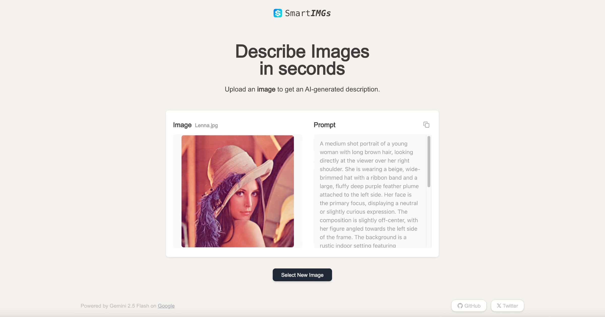

# SmartIMGs

SmartIMGs 是一款基于 Next.js 构建的 AI 驱动应用，专注于提供极简、高效、精准的逆向图像提示词生成服务。生成的提示词可直接用于 AI 图像生成，帮助您最大程度还原并重现原始图片的视觉效果与细节。

SmartIMGs is an AI-powered application built with Next.js, focused on providing simple, efficient, and accurate reverse image prompt generation. The generated prompts can be directly used for AI image generation, helping you maximally recreate the visual effects and details of the original image.

## 📸 预览 / Preview



## ✨ 核心功能 / Core Features

- 🚀 **一键操作**：上传图片即可自动生成提示词，简单高效。  
  **One-click Operation**: Upload an image to automatically generate prompts, simple and efficient.
  
- 🖋️ **精准提示词**：利用先进AI模型分析图片内容，生成详细准确的提示词。  
  **Accurate Prompts**: Utilize advanced AI models to analyze image content, generating detailed and accurate prompts.
  
- 🌍 **双语支持**：支持中英文提示词生成，满足不同用户需求。  
  **Bilingual Support**: Support for both Chinese and English prompt generation to meet different user needs.
  
- 🤖 **先进多模态模型**：采用 Google Gemini 2.5 Flash 多模态模型，提示词更准确。  
  **Advanced Multimodal Model**: Using Google Gemini 2.5 Flash multimodal model for more accurate prompts.
  
- 📱 **响应式设计**：适配桌面和移动设备，随时随地使用。  
  **Responsive Design**: Adapted for both desktop and mobile devices, use anytime, anywhere.

## 🛠️ 技术栈 / Tech Stack

- **框架/Framework**: Next.js 15.3 (App Router)
- **开发语言/Language**: TypeScript
- **样式/Styling**: Tailwind CSS
- **AI服务/AI Service**:
  - Google Gemini SDK
  - gemini-2.5-flash-preview 模型/model
- **交互/Interaction**:
  - react-dropzone (图片上传/image upload)

## 🚀 快速开始 / Quick Start

1. 克隆仓库 / Clone the repository:

```bash
git clone https://github.com/jamez-bondos/smartimgs.git
```

2. 安装依赖 / Install dependencies:

```bash
npm install
```

3. 创建环境变量文件 / Create environment variable file `.env`:

```
# Google Gemini API Key
GEMINI_API_KEY= <google ai studio api key>
GEMINI_BASE_URL=https://generativelanguage.googleapis.com/v1beta/openai/
GEMINI_MODEL="gemini-2.5-flash-preview-04-17"

# OpenRouter API Key
# GEMINI_API_KEY= <openrouter api key>
# GEMINI_BASE_URL=https://openrouter.ai/api/v1
# GEMINI_MODEL="google/gemini-2.5-flash-preview"
```

选择 Google Gemini 或者 OpenRouter 中的一种。
Choose either Google Gemini or OpenRouter.

获取 Gemini API Key / Get Gemini API Key: https://ai.google.dev/gemini-api/docs/api-key

4. 启动开发服务器 / Start the development server:

```bash
npm run dev
```

## 💡 使用指南 / Usage Guide

1. 点击或拖拽上传您的图片（支持PNG、JPEG、WEBP格式）。  
   Click or drag and drop to upload your image (PNG, JPEG, WEBP formats supported).
   
2. 选择提示词语言（支持中文和英文）。  
   Select prompt language (Chinese and English supported).
   
3. 点击"生成提示词"按钮开始处理。  
   Click the "Generate" button to start processing.
   
4. 等待系统生成提示词。  
   Wait for the system to generate the prompt.
   
5. 查看并复制生成的提示词，可直接用于 AI 图像生成。  
   View and copy the generated prompt, which can be directly used for AI image generation.

## 🤝 贡献指南 / Contribution Guide

欢迎贡献！请随时提交 Pull Request。  
Contributions are welcome! Feel free to submit a Pull Request.

## 🙏 Credits

本项目参考与借鉴了以下优秀的开源项目和资源：  
This project references and draws from the following excellent open source projects and resources:

- 项目结构基于 / Project structure based on [https://github.com/Nutlope/smartpdfs](https://github.com/Nutlope/smartpdfs)
- 提示词参考 / Prompt reference: [@dontbesilent12](https://x.com/dontbesilent12/status/1919633554352570511)
- 项目灵感来源 / Project inspiration: [https://github.com/hellokaton/remove-bg](https://github.com/hellokaton/remove-bg)

## 📝 许可证 / License

[MIT](LICENSE)
